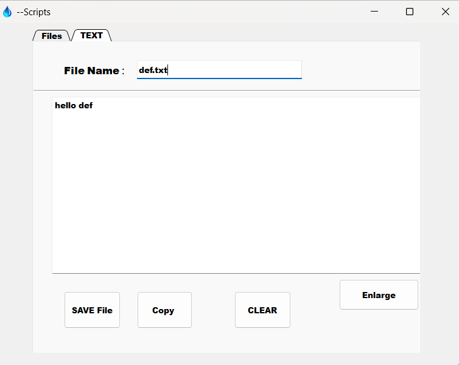

## Scriptx 

- It is a pyqt5 application used to write files for rough purposes 

## Versions 

- currenty it has two tabs as follows 

## For code 

- Just do as follows :
<code> git clone https://github.com/Rishabh-creator601/ScriptX.git </code>
<code> python main.py</code>
